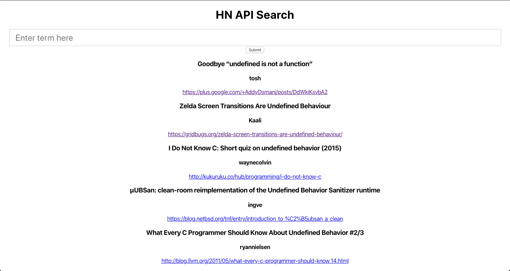
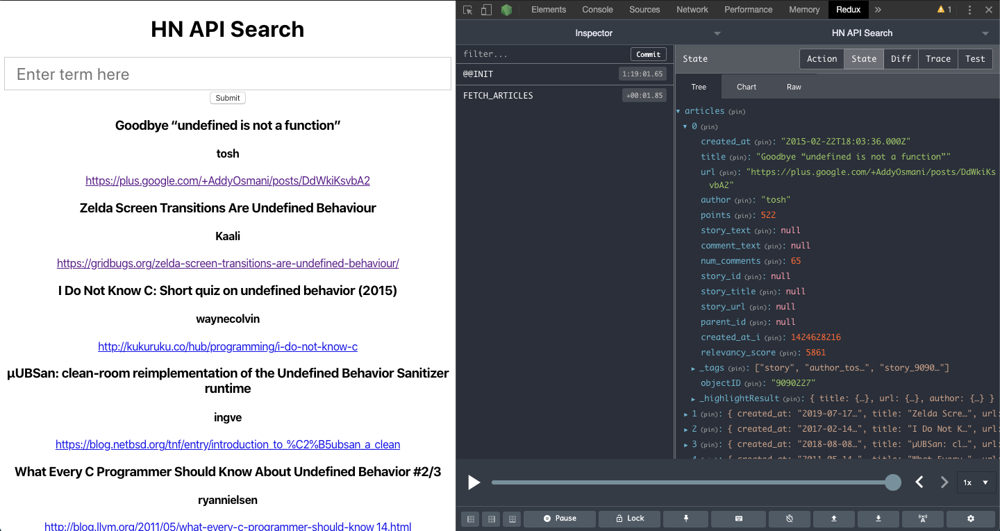
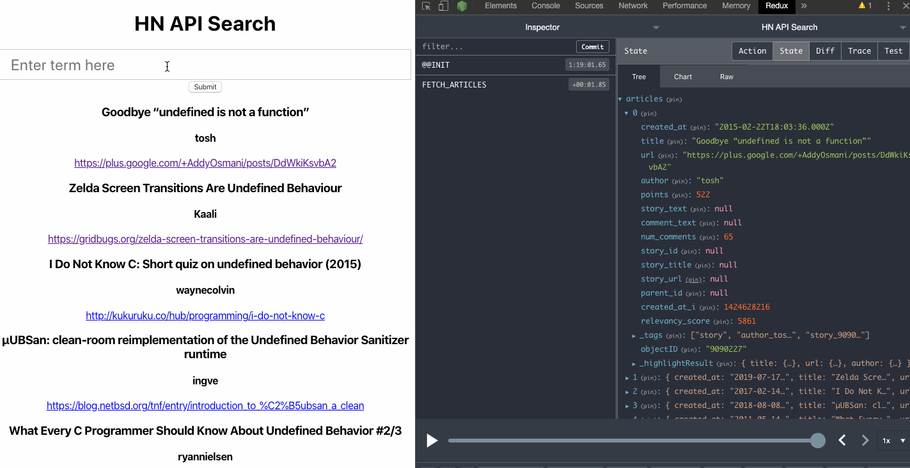

# HN API Search

## Overview
This is a React app that accesses the Hacker News API through a specific search term and stores the search results in a Redux state.

---

## Technologies
- HackerNews API
- ReactJS
- ReduxJS

---

## Demo

Here the homepage automatically renders articles because the HN API reads the empty search query as "undefined" and finds articles with undefined in their titles.

As shown here with Redux DevTools, we can track the results as objects in an "articles" array in the redux state.

As the video below shows, the redux state is updated with new search results when a new search term is inputted through either pressing the submit button or hitting enter.

